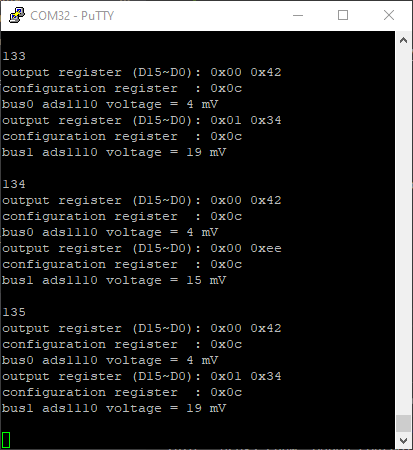

# _ESP-ADS1110 project_

实现 esp32 读写 ads1110 芯片的功能

* ADS1110: 16-Bit ANALOG-TO-DIGITAL CONVERTER with Onboard Reference

* MCU: ESP32

* IDE: VSCode

* Framework: esp-idf

* Library: esp-idf-lib (ues i2cdev library)

## How to use

1. install [VSCode + Espressif IDF](https://yyii.site/2022/05/02/ESP32-Window-VSCode)

2. clone [esp-idf-lib](https://github.com/UncleRus/esp-idf-lib)   (**Your Name**)

```
C:\Users\Your Name\
├── .espressif
│   ├── xxx
├── esp
│   ├── esp-idf
│       ├── xxx
│   ├── esp-idf-lib
│       ├── xxx
├── xxx
```

3. clone ESP32-ADS1110 project

4. add esp-idf-lib path for `ESP32-ADS1110/.vscode/c_cpp_properties.json`

```c
"C:\\Users\\Your Name\\esp\\esp-idf-lib\\components\\**"
```

5. add esp-idf-lib path for `ESP32-ADS1110/CMakeLists.txt`

```cmake
set(EXTRA_COMPONENT_DIRS $ENV{IDF_PATH}/../esp-idf-lib/components)
```

5. Build and Flash

6. open Monitor 




